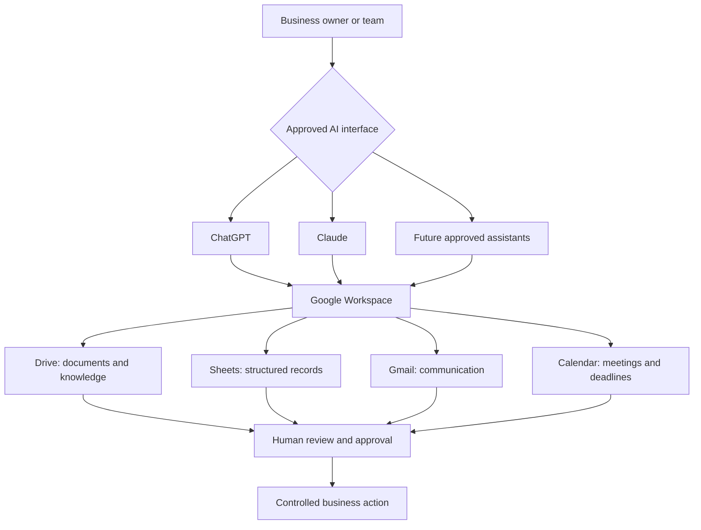
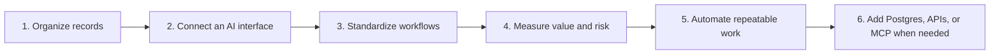

# AI Workspace for Small Business

**A provider-neutral architecture for turning Google Workspace into an AI-enabled business operating system with ChatGPT, Claude, or future AI assistants.**

Small businesses are often told to buy another CRM, automate everything, and deploy AI agents.

But many already have most of the required infrastructure:

- Google Drive for documents and knowledge
- Google Sheets for records and tracking
- Gmail for communication
- Google Calendar for meetings and deadlines
- ChatGPT, Claude, or another approved AI assistant for conversational access

What is missing is usually not one more application. It is an operating architecture that creates reliable records, gives information a clear home, connects it to AI safely, and keeps the business owner in control.

> **Do not automate chaos. Establish operational truth first.**

## The core architecture



The AI assistant is not the system of record. It is an interface above the system of record.

## The seven design principles

1. **Canonical truth** — every important fact has one authoritative location.
2. **Stable identifiers** — clients, projects, cases, jobs, opportunities, or orders receive permanent IDs.
3. **Provider-neutral AI** — ChatGPT and Claude are interfaces, not permanent infrastructure dependencies.
4. **Minimum necessary access** — the assistant retrieves only what the current task requires.
5. **Human-controlled actions** — AI drafts and proposes; people approve consequential actions.
6. **Progressive architecture** — begin with files and Sheets, then add automation or databases only when evidence justifies them.
7. **Measurable operating value** — adoption is judged by fewer missed actions, faster retrieval, better preparation, and reduced administrative burden.

## Who this is for

This framework is designed for small businesses and professional teams that:

- already use Google Workspace;
- track clients, jobs, opportunities, orders, or projects in spreadsheets;
- store important knowledge across folders and inboxes;
- depend too heavily on the owner’s memory;
- miss follow-ups, handoffs, or deadlines;
- use ChatGPT or Claude mainly as writing tools;
- are considering a CRM, specialized platform, automation, or custom system;
- want practical AI adoption without beginning with a large transformation project.

## Start small, grow deliberately



The framework does **not** argue that every small business should avoid a CRM or custom software. It argues that technology decisions should follow observed workflow evidence.

## Three operating-model examples

The examples are organized by how work moves through a business rather than by a narrow industry label.

### 1. Client Delivery Business

For consulting firms, agencies, engineering practices, software studios, architecture offices, and other teams that deliver knowledge-intensive work.

Demonstrates:

- client and project records;
- proposals, contracts, meetings, and deliverables;
- portfolio and project reviews;
- approval-controlled follow-up;
- decisions between CRM, project management, automation, and a custom data layer.

[Read the Client Delivery Business case study](examples/client-delivery-business.md).

### 2. Field Service Contractor

For maintenance, installation, repair, construction, fit-out, inspection, and other businesses coordinating office staff with field crews.

Demonstrates:

- inquiries, inspections, quotations, jobs, crews, and materials;
- Job IDs and field evidence;
- readiness checks and crew briefs;
- completion records and invoice-readiness review;
- decisions between Google Workspace, field-service software, inventory systems, and controlled custom tools.

[Read the Field Service Contractor case study](examples/field-service-contractor.md).

### 3. B2B Sales and Distribution Business

For equipment suppliers, wholesalers, importers, building-materials distributors, and other teams coordinating customers, suppliers, quotations, orders, and delivery.

Demonstrates:

- customer, opportunity, quotation, and order records;
- approved price and product sources;
- pipeline and quotation review;
- sales-to-fulfillment handoffs;
- decisions between CRM, inventory or ERP systems, automation, and a custom structured layer.

[Read the B2B Sales and Distribution case study](examples/b2b-sales-and-distribution.md).

Together, the examples cover three distinct patterns:

```text
knowledge-based client delivery
+ mobile field execution
+ sales-to-fulfillment coordination
```

All organizations, records, identities, figures, and URLs in the examples are fictional.

## Repository map

- [White paper](WHITEPAPER.md)
- [Reference architecture](docs/reference-architecture.md)
- [Governance and security](docs/governance-and-security.md)
- [Implementation roadmap](docs/implementation-roadmap.md)
- [When Google Workspace is no longer enough](docs/when-you-need-a-database.md)
- [Provider-neutral AI interface](docs/provider-neutral-ai.md)
- [Client Delivery Business case study](examples/client-delivery-business.md)
- [Field Service Contractor case study](examples/field-service-contractor.md)
- [B2B Sales and Distribution case study](examples/b2b-sales-and-distribution.md)
- [Master client index template](templates/master-client-index.md)
- [Client hub template](templates/client-hub.md)
- [Meeting note template](templates/meeting-note.md)
- [AI operating instructions](templates/ai-operating-instructions.md)
- [AI Workspace Assessment](assessment/ai-workspace-assessment.md)
- [Readiness scorecard](assessment/readiness-scorecard.md)
- [Official references](REFERENCES.md)
- [Contributing](CONTRIBUTING.md)
- [Licensing](LICENSE.md)

## A simple example

A client-delivery business could use:

```text
CLIENT-2026-001
    ↓
Master Client Index row
    ↓
Stable Client Hub URL
    ├── current outcome
    ├── next action and owner
    ├── meeting history
    ├── proposal and contract links
    └── project documents
```

Then the owner can ask an approved AI assistant:

- “Which active records have no next action?”
- “Prepare tomorrow’s meeting using the Hub and latest approved notes.”
- “Draft a follow-up based on agreed actions. Do not send it.”
- “Show deadlines in the next 14 days.”
- “Cite the source used for each claim.”

The same principles apply to jobs, opportunities, and orders through their own stable IDs and canonical Hubs.

## Current capability boundary

Current ChatGPT and Claude integrations can connect to Google Workspace, but exact features vary by product plan, workspace administration, OAuth scopes, enabled actions, region, and account settings.

This repository therefore treats integrations as **capabilities that must be verified**, not assumptions. A safe implementation begins read-only, tests with fictional or non-sensitive data, and adds write actions only after approval rules are established.

See [Official references](REFERENCES.md) for the current vendor documentation used by this framework.

## AI Workspace Assessment

A useful implementation starts with the real workflow, not a software shopping list.

The assessment examines:

- where business information currently lives;
- which workflows depend on memory;
- where follow-ups and deadlines are lost;
- what ChatGPT or Claude can support immediately;
- what must remain human-controlled;
- whether the business needs a CRM, specialized platform, database, automation, or none of them yet;
- a practical 30-, 60-, and 90-day roadmap.

Use the free [AI Workspace Assessment](assessment/ai-workspace-assessment.md) and [Readiness Scorecard](assessment/readiness-scorecard.md).

## Contact

For implementation, advisory work, or an **AI Workspace Assessment**:

- Email: [tsolmon.khudulmur@gmail.com](mailto:tsolmon.khudulmur@gmail.com)
- LinkedIn: [Tsolmon Khudulmur](https://www.linkedin.com/in/tsolmon-khudulmur)
- GitHub: [mootsoo](https://github.com/mootsoo)

Do not send confidential client data, credentials, contracts, or private documents in an initial message or public issue.

## Status

**Version:** 1.1  
**Author:** Tsolmon Khudulmur  
**Initial publication:** August 4, 2026  
**Last updated:** August 5, 2026

This is a practical reference architecture, not legal, privacy, cybersecurity, or regulatory certification. Each business remains responsible for its own data, permissions, contractual duties, and professional decisions.

## Licensing

Unless otherwise noted:

- written framework material, diagrams, assessments, case studies, and templates are licensed under **CC BY 4.0**;
- future sample code is licensed under **Apache 2.0**.

See [Licensing](LICENSE.md) for details.
