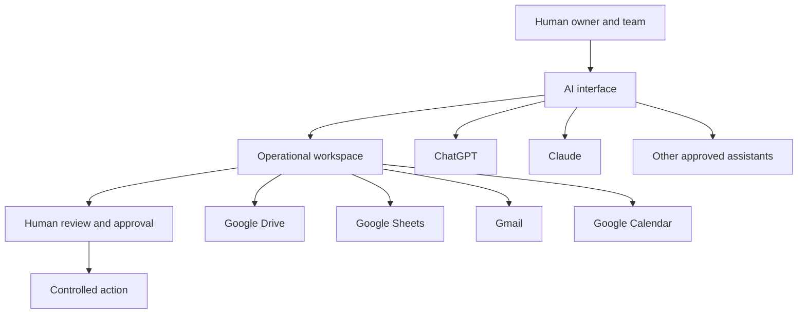
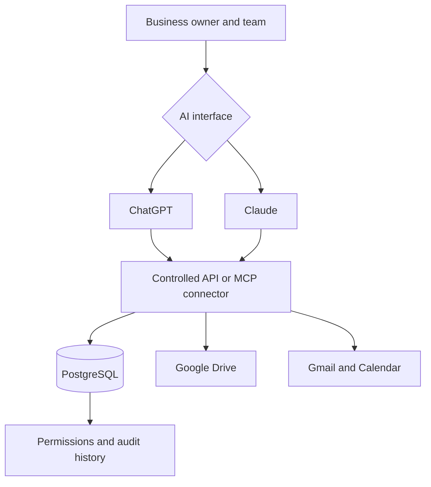

# You May Not Need Another CRM

## How small businesses can turn Google Workspace into an AI-enabled operating system with ChatGPT, Claude, or future AI assistants

**Author:** Tsolmon Khudulmur  
**Version:** 1.0  
**Date:** August 4, 2026

---

## Executive summary

Small businesses are under pressure to adopt artificial intelligence. The usual advice is to buy a new CRM, automate every workflow, connect an AI agent, and move more of the business into specialized software.

That advice is sometimes correct. It is also often premature.

Many small businesses already run on a practical but fragmented operating stack:

- Google Drive stores proposals, contracts, reports, templates, and client documents.
- Google Sheets tracks customers, projects, payments, tasks, or service cases.
- Gmail contains customer history and commitments.
- Google Calendar contains meetings, deadlines, and delivery rhythms.
- The owner’s memory connects everything that the software does not.

The problem is not necessarily the absence of a CRM. The problem is that the business lacks a coherent operating architecture.

This white paper proposes a provider-neutral **AI Workspace Architecture for Small Business**. It treats Google Workspace as the operational data layer and ChatGPT, Claude, or another approved assistant as a conversational interface above that layer.

The core idea is simple:

> **Google Workspace stores operational truth. AI finds, analyzes, and drafts. People decide and approve.**

The architecture begins with organization, stable identifiers, clear sources of truth, minimum-access retrieval, and approval boundaries. It introduces automation only after a workflow has become repeatable. It introduces Postgres, custom APIs, Model Context Protocol connectors, or specialized applications only when the lightweight workspace has produced evidence that they are needed.

This is not an argument against CRM, ERP, databases, or automation. It is an argument against automating disorder.

> **Do not automate chaos. Establish operational truth first.**

---

## 1. The operating problem hiding inside small businesses

A small business may look simple from outside. Inside, it is usually a web of partially connected records, messages, promises, documents, deadlines, and decisions.

A typical owner may have:

- client names in a spreadsheet;
- proposals in several Drive folders;
- meeting notes in Docs;
- deadlines in Calendar;
- important decisions inside email threads;
- follow-ups in a notebook or chat;
- undocumented context in memory;
- different naming conventions used by different team members.

This creates five recurring problems.

### 1.1 Information exists, but cannot be retrieved reliably

The team knows a document exists, but not which folder contains the current version. A meeting happened, but nobody can quickly identify the agreed next action. A customer’s history is distributed across email, files, and memory.

### 1.2 The owner becomes the integration layer

When the business lacks a coherent information model, the owner becomes the person who explains:

- where the document is;
- which version is correct;
- why the customer is waiting;
- who promised what;
- what must happen next.

This creates operational fragility. The business works because one person remembers the connections.

### 1.3 Follow-ups are treated as personal discipline instead of system design

Missed follow-ups are often blamed on individuals. But a business that has no canonical next action, owner, and date is designed to lose commitments.

### 1.4 AI is used as a writing tool, not an operating interface

Many small businesses use ChatGPT or Claude to rewrite emails, brainstorm marketing content, or summarize pasted text. That creates isolated productivity gains, but does not improve the operating system of the business.

The larger opportunity is to let an approved AI assistant retrieve the relevant business context, reason across the permitted sources, prepare a decision or draft, cite its evidence, and wait for human approval.

### 1.5 New software may create another silo

A CRM can solve real problems. It can also become one more place where people must re-enter information. If the team does not know which system owns which fact, a new platform can increase duplication rather than reduce it.

---

## 2. Why “buy a CRM” is not always the first answer

A customer relationship management platform is valuable when a business has a repeatable pipeline, multiple users, structured reporting needs, and enough operating discipline to maintain it.

It is less valuable when:

- the real service workflow is still changing;
- the business is document-heavy rather than transaction-heavy;
- most operational context remains in Drive and Gmail;
- only one or two people manage the work;
- the proposed CRM would duplicate the existing spreadsheet;
- team members will not consistently update the system;
- the business cannot yet define its stages, record ownership, or approval rules.

The right question is not:

> “Do we need a CRM?”

The better sequence is:

1. What decisions and actions must the business support?
2. Which records are required to support them?
3. Where should each record live?
4. Who owns each record?
5. Which actions should AI support?
6. Which actions require human approval?
7. What recurring pain remains after the lightweight system is used?
8. Does that pain justify a CRM, database, automation platform, or custom application?

A business may discover that it genuinely needs a CRM. It may also discover that a structured Google Workspace with an AI interface solves the immediate problem at lower cost and with less adoption friction.

---

## 3. The AI Workspace Architecture

The architecture has four layers.



### Layer 1: Human authority

The owner or authorized team member remains responsible for:

- customer and professional judgment;
- official records;
- external communication;
- financial or contractual commitments;
- access permissions;
- deletion and retention;
- final approval of consequential actions.

### Layer 2: Provider-neutral AI interface

ChatGPT, Claude, or another approved assistant can serve as the conversational interface.

The assistant may help to:

- retrieve information;
- compare records;
- identify missing actions;
- prepare meetings;
- summarize progress;
- draft communication;
- propose record updates;
- create low-risk artifacts when permitted.

The architecture does not make one AI provider the permanent source of truth. This reduces lock-in and allows the business to choose the assistant that best fits a task, plan, privacy posture, or capability.

### Layer 3: Operational workspace

Google Workspace remains the practical operating layer:

| Tool | Operational role |
|---|---|
| Google Drive | Documents, knowledge, templates, evidence, client folders |
| Google Sheets | Structured indexes, status, stage, owners, dates, lightweight reporting |
| Gmail | Customer communication and correspondence history |
| Google Calendar | Meetings, delivery dates, reviews, deadlines |

### Layer 4: Approval and controlled action

Retrieval and drafting are different from acting.

A safe workflow is:

```text
AI retrieves relevant sources
→ AI cites and summarizes
→ AI proposes a draft or change
→ Human reviews the exact target and effect
→ Approved action occurs
→ Human verifies the result
```

This boundary matters because current AI integrations can have different read and write capabilities depending on the product, plan, OAuth scopes, workspace administration, region, and settings. The architecture therefore requires capability verification rather than assuming every integration behaves the same way.

---

## 4. The seven design principles

### 4.1 One canonical home for each important fact

A business should be able to answer:

- Where is the authoritative client status?
- Where is the next action?
- Where are meeting decisions recorded?
- Where is the current proposal?
- Where is the deadline?

If the same fact is copied across a Sheet, Doc, email, and chat, it will eventually disagree with itself.

The architecture assigns each fact to one canonical location and links to it from other records.

### 4.2 Stable identifiers

Names are not reliable database keys. Businesses may have clients with similar names, renamed projects, recurring engagements, or changing contacts.

Use permanent identifiers such as:

```text
CLIENT-2026-001
PROJECT-2026-014
CASE-2026-007
ENGAGEMENT-2026-003
```

The same ID should appear in the index, folder, hub document, meeting notes, and later database record.

### 4.3 AI providers are interfaces, not databases

A conversation is not the canonical business record.

The business should remain usable if:

- the preferred AI provider changes;
- a connector is temporarily unavailable;
- a conversation is deleted;
- a model is upgraded;
- the team uses more than one assistant.

Important outcomes should return to the operational workspace after approval.

### 4.4 Retrieve the minimum necessary context

More context is not always better. Broad access increases the chance of irrelevant retrieval, accidental disclosure, and mixed records.

A task should begin with a clear scope:

```text
Work only on CLIENT-2026-001.
Use the Client Hub, latest meeting note, and current proposal.
Do not search unrelated client folders.
Do not change anything.
```

### 4.5 Separate facts, decisions, actions, suggestions, and uncertainty

An AI assistant may infer a reasonable next step. That does not make it a confirmed business fact.

Outputs should distinguish:

| Type | Meaning |
|---|---|
| Fact | Supported by a source |
| Decision | Explicitly agreed by an authorized person |
| Action | Has an owner and date |
| Suggestion | Proposed by the assistant or team, not approved |
| Needs confirmation | Missing, conflicting, or unsupported information |

### 4.6 Human approval must match the risk

Not every action needs the same control.

| Action type | Example | Recommended boundary |
|---|---|---|
| Read-only | Find a proposal | May run within authorized scope |
| Draft | Prepare follow-up text | Human reviews before external use |
| Reversible internal write | Create a private draft | Approval based on configured policy |
| Material record change | Change client stage or deadline | Explicit review of Before, After, Why |
| External communication | Send an email or publish content | Human approval and final verification |
| High-impact action | Contract, payment, deletion, access change | Strong authorization outside normal AI flow |

### 4.7 Add complexity only when evidence justifies it

The maturity path is progressive:

```text
Organized files and Sheets
→ connected AI retrieval
→ standardized workflows
→ measured operating evidence
→ selective automation
→ database and controlled tools
→ custom applications
```

This protects the business from building expensive infrastructure around an unproven workflow.

---

## 5. Five practical small-business use cases

### 5.1 Client management

A Master Client Index contains:

- permanent Client ID;
- status;
- current stage;
- next action;
- action owner;
- due date;
- risk;
- Client Hub URL;
- folder URL.

The AI assistant can answer:

- Which active clients have no next action?
- Which actions are overdue?
- Which clients are waiting on us?
- What changed since the last meeting?

### 5.2 Meeting preparation and follow-through

Before a meeting, the assistant retrieves the Client Hub, latest meeting note, relevant deliverables, and current deadlines.

It prepares:

- objective;
- current state;
- unresolved items;
- questions;
- decisions required;
- proposed next actions.

After the meeting, it converts notes into a standard format and proposes exact updates. The human approves the official record.

### 5.3 Sales follow-up

A small business may combine Gmail history with an opportunity index.

The assistant can identify:

- leads with no response;
- proposals awaiting follow-up;
- opportunities with missing next dates;
- conversations requiring a draft response.

The assistant drafts. The salesperson verifies the recipient, claims, price, and commitment before sending.

### 5.4 Project and service delivery

The architecture can support consulting, agencies, education services, legal operations, accounting practices, property services, and other professional work.

A Project Hub can link:

- scope;
- current milestone;
- deliverables;
- meeting notes;
- dependencies;
- client decisions;
- next actions;
- evidence of completion.

The assistant can produce a weekly status without reconstructing the project from memory.

### 5.5 Business knowledge

Drive often contains years of proposals, policies, templates, reports, and prior work.

With proper organization and permissions, an assistant can help answer:

- Have we solved a similar problem before?
- Which proposal language is current?
- What did we promise this customer?
- Which policy applies?
- Which source supports this claim?

The result is not merely faster search. It is a more reusable business memory.

---

## 6. A four-stage implementation roadmap

### Stage 1: Organize

**Goal:** Establish operational truth.

Actions:

- map the current workflow;
- identify canonical records;
- create stable IDs;
- define folder and naming conventions;
- create the Master Index;
- define Hub documents;
- remove unnecessary duplication;
- review access permissions;
- create templates.

Do not connect AI to disorganized sensitive data and call that transformation.

### Stage 2: Connect

**Goal:** Add safe conversational retrieval.

Actions:

- select ChatGPT, Claude, or both;
- verify current connector availability and scopes;
- begin read-only;
- install business-specific instructions;
- test with fictional or non-sensitive records;
- require citations;
- define one-case or one-client task boundaries;
- document provider-specific privacy and retention settings.

### Stage 3: Operate and measure

**Goal:** Prove value through repeated use.

Actions:

- use the system for meeting preparation;
- standardize notes and follow-up;
- run weekly operational reviews;
- measure retrieval time;
- count missing next actions;
- track missed deadlines;
- record manual duplication;
- identify connector limitations and permission friction.

Useful metrics include:

| Metric | Example baseline question |
|---|---|
| Retrieval time | How long does it take to prepare one client meeting? |
| Follow-up completeness | What percentage of active records have a next action and date? |
| Missed commitments | How many overdue customer actions exist? |
| Administrative effort | How many hours per week are spent formatting notes or status updates? |
| Record quality | How often do two sources disagree? |
| Adoption | Does the team actually use the workflow? |

### Stage 4: Productize selectively

**Goal:** Add technology only where the evidence supports it.

Possible additions:

- n8n or another automation platform for repeatable cross-system workflows;
- PostgreSQL for structured records and reliable reporting;
- a controlled API or MCP server for narrow read and write tools;
- role-based access;
- audit history;
- dashboards;
- forms and onboarding workflows;
- a customer-facing application.

The decision should be linked to observed pain, volume, risk, or business value.

---

## 7. Governance and security are part of the architecture

Connecting an AI assistant to business data is not merely a productivity decision. It changes how information can be retrieved, combined, summarized, and acted upon.

A practical minimum governance model includes:

### 7.1 Dedicated business accounts

Do not mix sensitive business records into a shared family or personal account when a dedicated account or managed workspace is practical.

### 7.2 Restricted sharing

Sensitive Drive files should generally be restricted to specifically authorized accounts. “Anyone with the link” may allow access without account-level identification and is inappropriate for many confidential workflows.

### 7.3 Least privilege

Give users and AI integrations only the permissions required for the task. Read-only first is a safer default than broad write access.

### 7.4 Approval settings

Where the AI platform supports app permissions or action controls, configure approval requirements deliberately. For material business changes, “ask before any change” is safer than allowing broad autonomous actions.

### 7.5 Data minimization

Do not retrieve or copy a complete client folder when the task requires only the current proposal and meeting note.

### 7.6 Provider-specific controls

ChatGPT and Claude have different product plans, workspace controls, privacy settings, retention behavior, and connector capabilities. Each must be assessed separately.

### 7.7 Clear deletion and retention rules

The business should know:

- how long operational records are retained;
- how conversations containing business data are handled;
- what happens when a connector is disconnected;
- how customer correction or deletion requests are handled;
- which evidence must be retained for legal or contractual reasons.

This framework is not a substitute for legal, privacy, cybersecurity, or regulatory advice.

---

## 8. When Google Workspace is no longer enough

A lightweight workspace is not meant to become a permanent spreadsheet empire.

Consider a database or custom system when:

- several users edit the same records concurrently;
- duplicate or conflicting rows become common;
- reports require complex relationships;
- permissions must differ by role or client;
- the business needs a reliable audit trail;
- automation must update records transactionally;
- the active record volume makes Sheets difficult to govern;
- integrations require narrow, validated write operations;
- customer-facing workflows are needed;
- the cost of manual reconciliation exceeds the cost of software.

A future architecture may look like:



The assistant should not receive unrestricted SQL access. It should receive narrow business tools such as:

```text
search_clients
get_client_summary
list_overdue_actions
create_followup_draft
propose_stage_change
add_approved_meeting_note
```

These tools create a controlled business interface rather than exposing the entire database.

---

## 9. Expected outcomes

A well-designed AI workspace can create value in six areas.

### Faster retrieval

People spend less time searching folders and reconstructing history.

### Better meeting preparation

Relevant context, unresolved decisions, and deadlines are assembled consistently.

### Fewer missed actions

Every active record has a visible next action, owner, and date.

### More reusable knowledge

Past work becomes discoverable and useful instead of remaining buried in Drive.

### Lower administrative burden

Standard drafts, notes, summaries, and reviews reduce repetitive formatting and compilation.

### Better technology decisions

The business learns whether it needs a CRM, automation platform, database, or custom application from evidence rather than vendor pressure.

The architecture should not be judged by how many AI features are enabled. It should be judged by operational outcomes.

---

## 10. The AI Workspace Assessment

A good implementation begins with discovery.

The assessment asks:

1. Where does operational information live today?
2. Which records are authoritative?
3. Which tasks depend on the owner’s memory?
4. Where are follow-ups lost?
5. Which workflows repeat often enough to standardize?
6. Which information is sensitive?
7. Which AI actions can begin read-only?
8. Which actions require explicit approval?
9. What should be measured during the pilot?
10. Which future technology decision would be justified by evidence?

The output should include:

- current-state information map;
- canonical record model;
- risk and permission map;
- prioritized use cases;
- provider and connector options;
- pilot design;
- success measures;
- 30-, 60-, and 90-day roadmap;
- recommendation on CRM, automation, database, or custom development.

Use the public [AI Workspace Assessment](assessment/ai-workspace-assessment.md) and [Readiness Scorecard](assessment/readiness-scorecard.md) in this repository.

---

## Conclusion

Small businesses do not need to choose between ignoring AI and buying an enterprise transformation program.

There is a practical middle path:

1. organize the information already in the business;
2. establish stable records and ownership;
3. connect an approved AI assistant;
4. begin with retrieval and drafting;
5. keep people responsible for consequential decisions;
6. measure operating value;
7. add automation and custom software only where the evidence supports it.

The result is not a chatbot sitting beside a messy business.

It is a business with clearer operational truth, a conversational interface, stronger follow-through, and a deliberate path to more advanced systems.

> **Start with the tools you already have. Build custom software when the workflow earns it.**

---

## About the author

**Tsolmon Khudulmur** is an IT leader, enterprise architect, and digital-transformation practitioner from Mongolia. His work focuses on connecting business strategy, operating models, information architecture, AI systems, and practical implementation.

For an AI Workspace Assessment, advisory work, or implementation discussion, connect with [Tsolmon Khudulmur on LinkedIn](https://www.linkedin.com/in/tsolmon-khudulmur) or through the [mootsoo GitHub profile](https://github.com/mootsoo). Mention **AI Workspace Assessment** in your message. Do not post confidential business information in a public repository issue.

**Public framework:** https://github.com/mootsoo/ai-workspace-for-small-business

---

## Disclaimer

This white paper is a practical architecture and operating framework. It is not legal advice, privacy certification, cybersecurity assurance, regulatory guidance, or a guarantee of business outcomes. Product capabilities change over time and must be verified against current official documentation and account settings.

See [Official references](REFERENCES.md).
