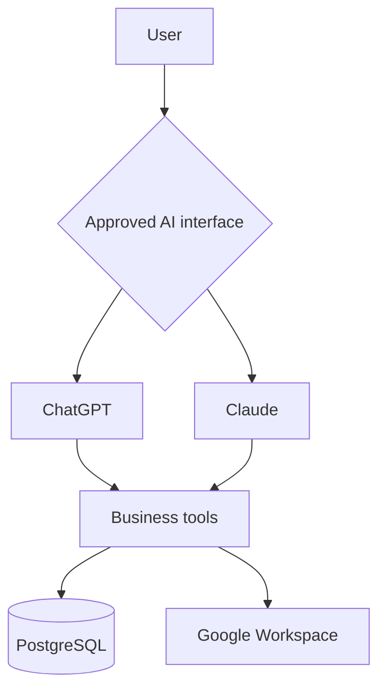

# Provider-Neutral AI Interface

## Why the business should not become dependent on one assistant

The framework supports ChatGPT, Claude, and future approved assistants because the operational system should outlive a provider choice.

## 1. The provider-neutral principle

> **The AI provider is an interface. The business-controlled workspace is the source of truth.**

A business may prefer one assistant for document work, another for analysis, or a future provider for cost, privacy, or capability reasons. The core record model should not change.

## 2. What remains stable across providers

| Stable component | Example |
|---|---|
| Record identity | `CLIENT-2026-001` |
| Master Index | Current status, stage, risk, action, owner, dates |
| Hub document | Stable current summary and source links |
| Documents | Google Drive |
| Communication | Gmail |
| Schedule | Google Calendar |
| Approval authority | Business owner or authorized person |
| Templates | Provider-neutral instructions and record formats |

## 3. What varies by provider

- plan availability;
- regional availability;
- connector names and setup menus;
- read and write actions;
- supported file types;
- workspace administration;
- OAuth scopes;
- approval settings;
- privacy, training, memory, and retention behavior;
- citation behavior;
- model strengths;
- cost and usage limits.

These differences belong in provider-specific setup notes, not in the permanent architecture.

## 4. Selection criteria

Score the actual account, not a marketing assumption.

| Criterion | Weight | ChatGPT | Claude | Notes |
|---|---:|---:|---:|---|
| Required Google access works | 20 |  |  | Verify in the account |
| Source citations are clear | 15 |  |  | Test with fictional data |
| Approval controls fit the risk | 15 |  |  | Check provider and admin settings |
| Privacy and retention fit policy | 15 |  |  | Review current official terms |
| Team can use it consistently | 10 |  |  | Adoption matters |
| Output quality for primary workflow | 10 |  |  | Test real task patterns safely |
| Cost and limits | 5 |  |  | Include admin time |
| Provider portability | 5 |  |  | Avoid provider-only record formats |
| Administrative controls | 5 |  |  | Important for teams |

## 5. Using both providers

A business can use both ChatGPT and Claude safely if it follows task ownership.

### Good pattern

```text
Claude prepares a document-heavy meeting brief.
ChatGPT runs a cross-source weekly operations review.
The human approves final records.
Google Workspace remains canonical.
```

### Bad pattern

```text
ChatGPT updates a client row.
Claude updates the same row from an older conversation.
Nobody verifies which value is current.
```

## 6. Single-writer task rule

For each write task:

1. select one assistant;
2. identify the canonical target;
3. refresh the source;
4. show Before, After, and Why;
5. obtain approval;
6. perform one bounded write;
7. verify the result;
8. treat later provider work as a new task against the refreshed source.

## 7. Portable AI instructions

The core instructions should avoid provider-specific menu language.

Example:

```text
You are the business operations assistant for [BUSINESS].

Use Google Workspace as the source of truth.
Work only on the record or scope identified by the user.
Retrieve the minimum necessary sources.
Cite the files, emails, Sheet data, or Calendar events used.
Separate Fact, Decision, Action, Suggestion, and Needs confirmation.
Use absolute dates.
Prepare drafts before writes.
Before any change, show the target, Before, After, Why, source, and effect.
Never send, publish, delete, share, pay, sign, or make a professional decision without explicit human authority.
Do not treat chat memory as the canonical record.
```

Provider-specific setup can then explain how to connect apps and configure approvals.

## 8. Portability test

The architecture passes the portability test when:

- a second provider can retrieve the same fictional record by ID;
- the Hub and Master Index require no redesign;
- the same output template works;
- citations point to the same business-controlled sources;
- the first provider's chat history is not required;
- the business can disconnect one provider without losing operational truth.

## 9. Future custom interface

When Postgres or a custom API is introduced, both providers should call the same narrow business tools when technically and commercially practical.



This preserves provider choice and concentrates business rules in the controlled tool layer.

## 10. Capability verification record

Maintain a simple record:

| Field | Value |
|---|---|
| Provider |  |
| Product and plan |  |
| Connected account |  |
| Verification date |  |
| Drive read | Pass / Fail |
| Sheets read | Pass / Fail |
| Gmail read | Pass / Fail |
| Calendar read | Pass / Fail |
| Draft creation | Pass / Fail / Not enabled |
| File write | Pass / Fail / Not enabled |
| Approval setting |  |
| Privacy setting reviewed | Yes / No |
| Test record |  |
| Known limitations |  |
| Reviewer |  |

Re-verify after material provider, plan, scope, or workspace changes.
