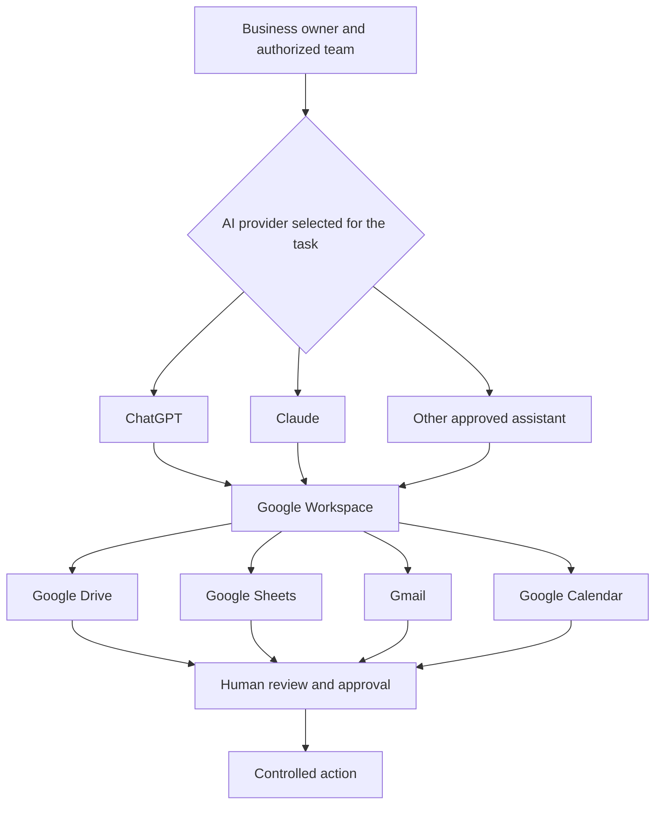
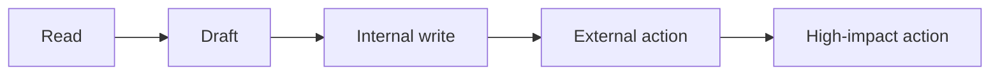
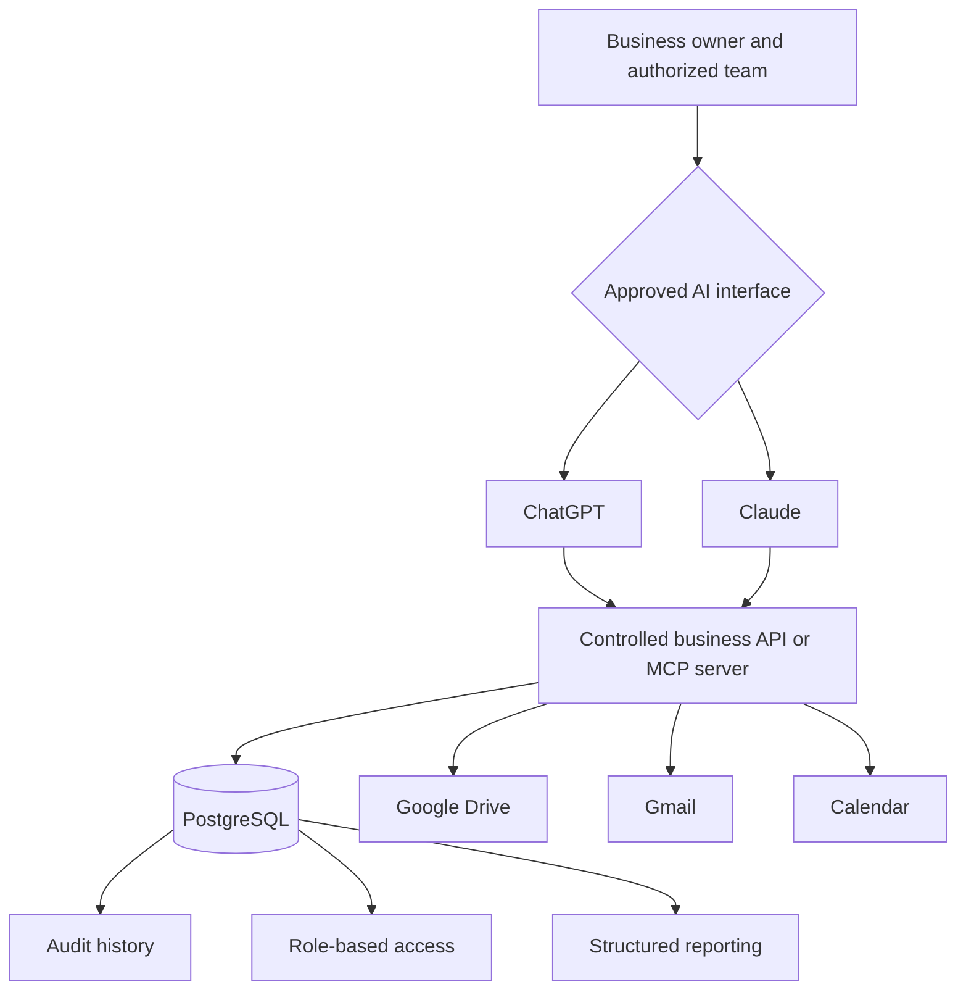

# Reference Architecture

## AI Workspace for Small Business

This document defines the provider-neutral reference architecture behind the framework.

## 1. Architectural objective

Enable a small business to use an approved AI assistant as a conversational operating interface without making the AI provider, chat history, or connector the source of truth.

The architecture should:

- preserve human decision authority;
- keep operational records in business-controlled systems;
- support ChatGPT, Claude, or future assistants;
- begin with read-only retrieval and draft preparation;
- allow controlled actions only after explicit governance;
- provide a migration path from Google Sheets to Postgres;
- prevent the lightweight pilot from becoming an ungoverned spreadsheet empire.

## 2. Current-state architecture



## 3. Logical components

| Component | Responsibility | Must not become |
|---|---|---|
| Human owner | Judgment, approval, accountability, permissions | A manual command relay for routine safe operations |
| AI interface | Retrieval, synthesis, preparation, drafting, proposals | The authoritative record or autonomous decision-maker |
| Master Index | Structured current state across records | A storage location for every detail or document |
| Hub document | Stable entry point for one client, project, case, or engagement | A duplicated history of every source file |
| Google Drive | Documents, knowledge, templates, evidence | A random folder dump with no canonical structure |
| Gmail | Communication history and drafts | The only place where commitments are recorded |
| Calendar | Meetings and deadlines | The only source of project or case status |
| Approval boundary | Review of target, content, effect, and risk | A meaningless click after the action is already effectively decided |

## 4. Canonical record pattern

A generic client record can use:

```text
CLIENT-2026-001
    ↓
Master Client Index
    ↓
Stable Client Hub URL
    ├── Current outcome
    ├── Status and stage
    ├── Next action, owner, and date
    ├── Important decisions
    ├── Risks and dependencies
    ├── Latest summary
    └── Links to canonical documents
```

### Recommended division of truth

| Information | Canonical location |
|---|---|
| Client ID, status, stage, risk, next action, owner, dates | Master Index |
| Current summary and important links | Client Hub |
| Detailed meeting history | Dated meeting notes |
| Scope and deliverables | Proposal, agreement, or project plan |
| External communication | Gmail, with decisions returned to the Hub or meeting record |
| Meetings | Google Calendar |
| Policies and templates | System folder |

## 5. Stable identifier design

Use identifiers that are:

- permanent;
- unique;
- human-readable;
- independent of a person's name;
- independent of the current AI provider;
- reusable during database migration.

Examples:

```text
CLIENT-2026-001
LEAD-2026-014
PROJECT-2026-008
CASE-2026-003
ENGAGEMENT-2026-011
```

Never reuse a retired ID. Do not change an ID because a client changes name, stage, service, or account owner.

## 6. AI task contract

Every meaningful AI task should define:

1. **Identity** — which client, project, case, or record is in scope.
2. **Sources** — which files, Sheet, emails, or events may be used.
3. **Mode** — read-only, draft-only, or approved write.
4. **Output** — the exact result required.
5. **Approval** — what must be reviewed before an action.
6. **Evidence** — source citations or links.
7. **Boundary** — what the assistant must not access or do.

Example:

```text
Work only on CLIENT-2026-001.
Use the Client Hub, latest meeting note, and current proposal.
Prepare tomorrow's meeting agenda.
Separate confirmed facts, decisions, proposed questions, and needs confirmation.
Cite each source.
Do not change any file, create a draft, or search other client folders.
```

## 7. Single-task writer rule

If the business uses both ChatGPT and Claude, both may retrieve and analyze according to their permissions. They should not update the same canonical record concurrently.

For each write task:

- select one active assistant;
- identify the exact target;
- review the proposed Before, After, and Why;
- approve one write path;
- verify the result;
- refresh the source before another assistant proposes a later change.

This avoids last-write-wins confusion across providers.

## 8. Risk-tiered actions



| Tier | Example | Default control |
|---|---|---|
| Read | Retrieve files or summarize | Authorized scope and citations |
| Draft | Prepare email or note | Human review before use |
| Internal write | Update a Hub or create a private draft | Explicit change review |
| External action | Send, publish, invite, share | Human approval immediately before action |
| High impact | Payment, contract, deletion, access change | Strong owner authorization outside ordinary AI operation |

## 9. Future-state architecture



### Future tool design

Do not expose unrestricted SQL or broad administrative actions. Expose narrow business capabilities:

```text
search_clients
get_client_summary
list_client_deadlines
list_overdue_actions
create_followup_draft
propose_stage_change
add_approved_meeting_note
record_approved_decision
```

Each tool should validate:

- identity;
- permissions;
- required fields;
- allowed state transitions;
- idempotency where necessary;
- audit metadata;
- human approval requirements.

## 10. n8n and automation boundary

n8n or another workflow platform can connect external systems after a process becomes repeatable.

Good uses:

- intake form to proposed lead record;
- completed meeting to reminder for notes;
- approved status change to notification;
- upcoming deadline to internal alert;
- website inquiry to triage queue.

Bad uses:

- canonical decision logic;
- unrestricted student or client reasoning;
- core financial calculations;
- hidden business-state transitions;
- replacing the database or governance model.

The principle is:

> **The core system decides and records. Automation listens, routes, and delivers.**

## 11. Non-functional requirements

A mature implementation should define:

- availability expectations;
- backup and recovery;
- data retention;
- least-privilege permissions;
- audit history;
- incident response;
- connector failure behavior;
- source freshness;
- concurrency rules;
- cost visibility;
- provider portability;
- export and deletion procedures.

## 12. Architecture acceptance test

Before using sensitive live records, prove with fictional or non-sensitive data that:

- the correct record is found by ID;
- source citations are accurate;
- unrelated records are not mixed;
- missing information is marked as uncertain;
- no write occurs during read-only tasks;
- proposed changes show Before, After, and Why;
- approval is requested at the intended boundary;
- the resulting record is verifiable in Google Workspace;
- the workflow still works if the preferred AI provider changes.
